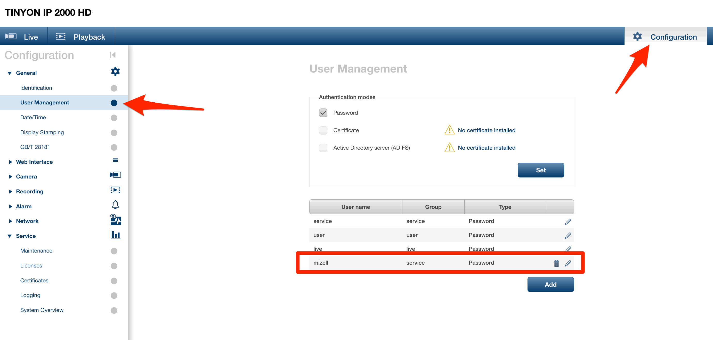
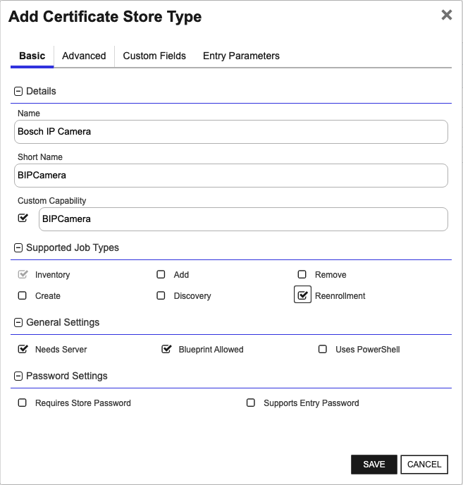
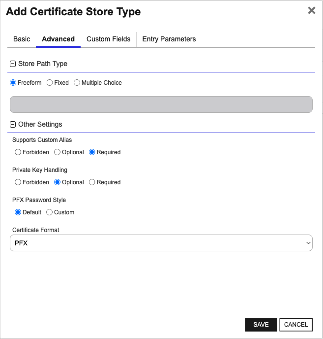
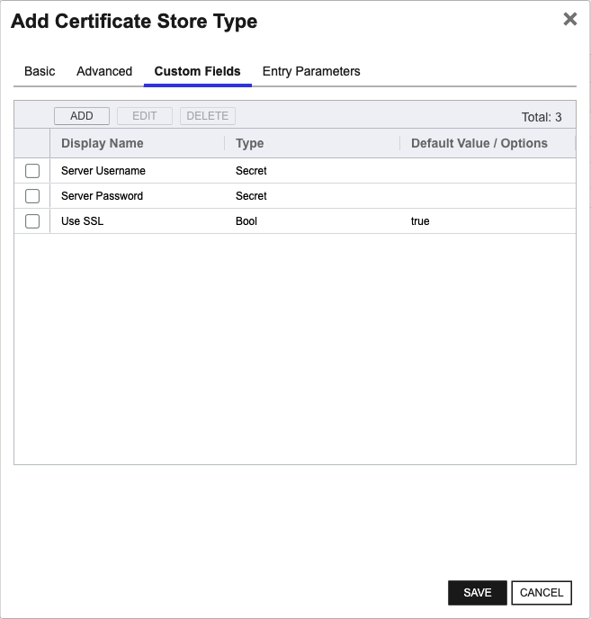
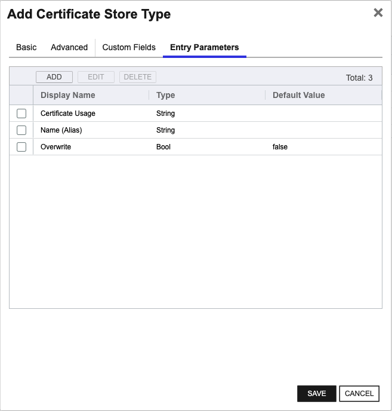
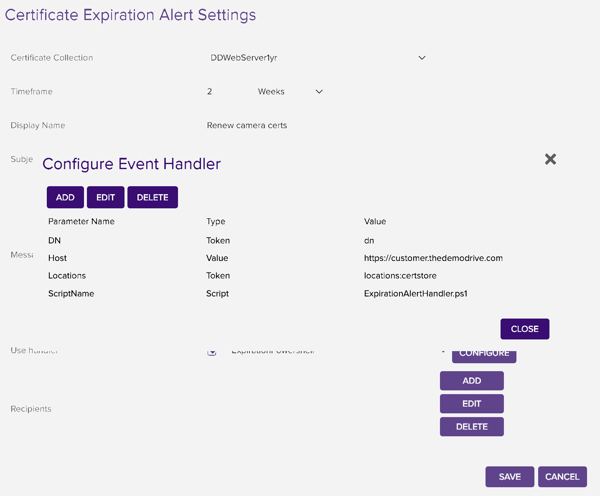

<h1 align="center" style="border-bottom: none">
    Bosch IP Camera Universal Orchestrator Extension
</h1>

<p align="center">
  <!-- Badges -->

<a href="https://github.com/Keyfactor/bosch-ipcamera-orchestrator/releases"></a>


</p>

<p align="center">
  <!-- TOC -->
  <a href="#support">
    <b>Support</b>
  </a>
  ·
  <a href="#installation">
    <b>Installation</b>
  </a>
  ·
  <a href="#license">
    <b>License</b>
  </a>
  ·
  <a href="https://github.com/orgs/Keyfactor/repositories?q=orchestrator">
    <b>Related Integrations</b>
  </a>
</p>

## Overview

The Bosch IP Camera Orchestrator remotely manages certificates on the camera.


## Compatibility

This integration is compatible with Keyfactor Universal Orchestrator version 10.1 and later.

## Support
The Bosch IP Camera Universal Orchestrator extension If you have a support issue, please open a support ticket by either contacting your Keyfactor representative or via the Keyfactor Support Portal at https://support.keyfactor.com. 
 
> To report a problem or suggest a new feature, use the **[Issues](../../issues)** tab. If you want to contribute actual bug fixes or proposed enhancements, use the **[Pull requests](../../pulls)** tab.

## Requirements & Prerequisites

Before installing the Bosch IP Camera Universal Orchestrator extension, we recommend that you install [kfutil](https://github.com/Keyfactor/kfutil). Kfutil is a command-line tool that simplifies the process of creating store types, installing extensions, and instantiating certificate stores in Keyfactor Command.


1. Out of the box, the camera comes with three accounts. You need an account created that has "service" level access:

2. Currently supports Bosch firmware version 7.10.0095 - 7.82. Has not been tested with any other firmeware version.


## BIPCamera Certificate Store Type

To use the Bosch IP Camera Universal Orchestrator extension, you **must** create the BIPCamera Certificate Store Type. This only needs to happen _once_ per Keyfactor Command instance.


### Supported Operations

| Operation    | Is Supported                                                                                                           |
|--------------|------------------------------------------------------------------------------------------------------------------------|
| Add          | 🔲 Unchecked        |
| Remove       | 🔲 Unchecked     |
| Discovery    | 🔲 Unchecked  |
| Reenrollment | ✅ Checked |
| Create       | 🔲 Unchecked     |

### Creation Using kfutil:
`kfutil` is a custom CLI for the Keyfactor Command API and can be used to created certificate store types.
For more information on [kfutil](https://github.com/Keyfactor/kfutil) check out the [docs](https://github.com/Keyfactor/kfutil?tab=readme-ov-file#quickstart)

#### Using online definition from GitHub:
This will reach out to GitHub and pull the latest store-type definition
```shell
# Bosch IP Camera
kfutil store-types create BIPCamera
```

#### Offline creation using integration-manifest file:
If required, it is possible to create store types from the [integration-manifest.json](./integration-manifest.json) included in this repo.
You would first download the [integration-manifest.json](./integration-manifest.json) and then run the following command
in your offline environment.
```shell
kfutil store-types create --from-file integration-manifest.json
```

### Manual Creation
If you do not wish to use the `kfutil` CLI then certificate store types can be creating in the web UI as described below.

* **Create BIPCamera manually in the Command UI**:
    <details><summary>Create BIPCamera manually in the Command UI</summary>

    Create a store type called `BIPCamera` with the attributes in the tables below:

    #### Basic Tab
    | Attribute | Value | Description |
    | --------- | ----- | ----- |
    | Name | Bosch IP Camera | Display name for the store type (may be customized) |
    | Short Name | BIPCamera | Short display name for the store type |
    | Capability | BIPCamera | Store type name orchestrator will register with. Check the box to allow entry of value |
    | Supports Add | 🔲 Unchecked |  Indicates that the Store Type supports Management Add |
    | Supports Remove | 🔲 Unchecked |  Indicates that the Store Type supports Management Remove |
    | Supports Discovery | 🔲 Unchecked |  Indicates that the Store Type supports Discovery |
    | Supports Reenrollment | ✅ Checked |  Indicates that the Store Type supports Reenrollment |
    | Supports Create | 🔲 Unchecked |  Indicates that the Store Type supports store creation |
    | Needs Server | ✅ Checked | Determines if a target server name is required when creating store |
    | Blueprint Allowed | ✅ Checked | Determines if store type may be included in an Orchestrator blueprint |
    | Uses PowerShell | 🔲 Unchecked | Determines if underlying implementation is PowerShell |
    | Requires Store Password | 🔲 Unchecked | Enables users to optionally specify a store password when defining a Certificate Store. |
    | Supports Entry Password | 🔲 Unchecked | Determines if an individual entry within a store can have a password. |

    The Basic tab should look like this:

    

    #### Advanced Tab
    | Attribute | Value | Description |
    | --------- | ----- | ----- |
    | Supports Custom Alias | Required | Determines if an individual entry within a store can have a custom Alias. |
    | Private Key Handling | Optional | This determines if Keyfactor can send the private key associated with a certificate to the store. Required because IIS certificates without private keys would be invalid. |
    | PFX Password Style | Default | 'Default' - PFX password is randomly generated, 'Custom' - PFX password may be specified when the enrollment job is created (Requires the Allow Custom Password application setting to be enabled.) |

    The Advanced tab should look like this:

    

    > For Keyfactor **Command versions 24.4 and later**, a Certificate Format dropdown is available with PFX and PEM options. Ensure that **PFX** is selected, as this determines the format of new and renewed certificates sent to the Orchestrator during a Management job. Currently, all Keyfactor-supported Orchestrator extensions support only PFX.

    #### Custom Fields Tab
    Custom fields operate at the certificate store level and are used to control how the orchestrator connects to the remote target server containing the certificate store to be managed. The following custom fields should be added to the store type:

    | Name | Display Name | Description | Type | Default Value/Options | Required |
    | ---- | ------------ | ---- | --------------------- | -------- | ----------- |
    | ServerUsername | Server Username | Enter the username of the configured "service" user on the camera | Secret |  | 🔲 Unchecked |
    | ServerPassword | Server Password | Enter the password of the configured "service" user on the camera | Secret |  | 🔲 Unchecked |
    | ServerUseSsl | Use SSL | Select True or False depending on if SSL (HTTPS) should be used to communicate with the camera. | Bool | true | ✅ Checked |

    The Custom Fields tab should look like this:

    

    #### Entry Parameters Tab

    | Name | Display Name | Description | Type | Default Value | Entry has a private key | Adding an entry | Removing an entry | Reenrolling an entry |
    | ---- | ------------ | ---- | ------------- | ----------------------- | ---------------- | ----------------- | ------------------- | ----------- |
    | CertificateUsage | Certificate Usage | The Certificate Usage to assign to the cert after upload. Can be left blank to be assigned later. | MultipleChoice |  | 🔲 Unchecked | 🔲 Unchecked | 🔲 Unchecked | 🔲 Unchecked |
    | Name | Name (Alias) | The certificate Alias, entered again. | String |  | 🔲 Unchecked | 🔲 Unchecked | 🔲 Unchecked | ✅ Checked |
    | Overwrite | Overwrite | Select `True` if using an existing Alias name to remove and replace an existing certificate. | Bool | false | 🔲 Unchecked | 🔲 Unchecked | 🔲 Unchecked | 🔲 Unchecked |

    The Entry Parameters tab should look like this:

    


## Installation

1. **Download the latest Bosch IP Camera Universal Orchestrator extension from GitHub.** 

    Navigate to the [Bosch IP Camera Universal Orchestrator extension GitHub version page](https://github.com/Keyfactor/bosch-ipcamera-orchestrator/releases/latest). Refer to the compatibility matrix below to determine whether the `net6.0` or `net8.0` asset should be downloaded. Then, click the corresponding asset to download the zip archive.

    | Universal Orchestrator Version | Latest .NET version installed on the Universal Orchestrator server | `rollForward` condition in `Orchestrator.runtimeconfig.json` | `bosch-ipcamera-orchestrator` .NET version to download |
    | --------- | ----------- | ----------- | ----------- |
    | Older than `11.0.0` | | | `net6.0` |
    | Between `11.0.0` and `11.5.1` (inclusive) | `net6.0` | | `net6.0` | 
    | Between `11.0.0` and `11.5.1` (inclusive) | `net8.0` | `Disable` | `net6.0` | 
    | Between `11.0.0` and `11.5.1` (inclusive) | `net8.0` | `LatestMajor` | `net8.0` | 
    | `11.6` _and_ newer | `net8.0` | | `net8.0` |

    Unzip the archive containing extension assemblies to a known location.

    > **Note** If you don't see an asset with a corresponding .NET version, you should always assume that it was compiled for `net6.0`.

2. **Locate the Universal Orchestrator extensions directory.**

    * **Default on Windows** - `C:\Program Files\Keyfactor\Keyfactor Orchestrator\extensions`
    * **Default on Linux** - `/opt/keyfactor/orchestrator/extensions`
    
3. **Create a new directory for the Bosch IP Camera Universal Orchestrator extension inside the extensions directory.**
        
    Create a new directory called `bosch-ipcamera-orchestrator`.
    > The directory name does not need to match any names used elsewhere; it just has to be unique within the extensions directory.

4. **Copy the contents of the downloaded and unzipped assemblies from __step 2__ to the `bosch-ipcamera-orchestrator` directory.**

5. **Restart the Universal Orchestrator service.**

    Refer to [Starting/Restarting the Universal Orchestrator service](https://software.keyfactor.com/Core-OnPrem/Current/Content/InstallingAgents/NetCoreOrchestrator/StarttheService.htm).


6. **(optional) PAM Integration** 

    The Bosch IP Camera Universal Orchestrator extension is compatible with all supported Keyfactor PAM extensions to resolve PAM-eligible secrets. PAM extensions running on Universal Orchestrators enable secure retrieval of secrets from a connected PAM provider.

    To configure a PAM provider, [reference the Keyfactor Integration Catalog](https://keyfactor.github.io/integrations-catalog/content/pam) to select an extension, and follow the associated instructions to install it on the Universal Orchestrator (remote).


> The above installation steps can be supplemented by the [official Command documentation](https://software.keyfactor.com/Core-OnPrem/Current/Content/InstallingAgents/NetCoreOrchestrator/CustomExtensions.htm?Highlight=extensions).


## Defining Certificate Stores


### Store Creation

* **Manually with the Command UI**

    <details><summary>Create Certificate Stores manually in the UI</summary>

    1. **Navigate to the _Certificate Stores_ page in Keyfactor Command.**

        Log into Keyfactor Command, toggle the _Locations_ dropdown, and click _Certificate Stores_.

    2. **Add a Certificate Store.**

        Click the Add button to add a new Certificate Store. Use the table below to populate the **Attributes** in the **Add** form.

        | Attribute | Description |
        | --------- | ----------- |
        | Category | Select "Bosch IP Camera" or the customized certificate store name from the previous step. |
        | Container | Optional container to associate certificate store with. |
        | Client Machine | The IP address of the Camera. Sample is "192.167.231.174:44444". Include the port if necessary. |
        | Store Path | Enter the Serial Number of the camera e.g. `068745431065110085` |
        | Orchestrator | Select an approved orchestrator capable of managing `BIPCamera` certificates. Specifically, one with the `BIPCamera` capability. |
        | ServerUsername | Enter the username of the configured "service" user on the camera |
        | ServerPassword | Enter the password of the configured "service" user on the camera |
        | ServerUseSsl | Select True or False depending on if SSL (HTTPS) should be used to communicate with the camera. |
    </details>


* **Using kfutil**
    
    <details><summary>Create Certificate Stores with kfutil</summary>
    
    1. **Generate a CSV template for the BIPCamera certificate store**

        ```shell
        kfutil stores import generate-template --store-type-name BIPCamera --outpath BIPCamera.csv
        ```
    2. **Populate the generated CSV file**

        Open the CSV file, and reference the table below to populate parameters for each **Attribute**.

        | Attribute | Description |
        | --------- | ----------- |
        | Category | Select "Bosch IP Camera" or the customized certificate store name from the previous step. |
        | Container | Optional container to associate certificate store with. |
        | Client Machine | The IP address of the Camera. Sample is "192.167.231.174:44444". Include the port if necessary. |
        | Store Path | Enter the Serial Number of the camera e.g. `068745431065110085` |
        | Orchestrator | Select an approved orchestrator capable of managing `BIPCamera` certificates. Specifically, one with the `BIPCamera` capability. |
        | ServerUsername | Enter the username of the configured "service" user on the camera |
        | ServerPassword | Enter the password of the configured "service" user on the camera |
        | ServerUseSsl | Select True or False depending on if SSL (HTTPS) should be used to communicate with the camera. |
    3. **Import the CSV file to create the certificate stores**

        ```shell
        kfutil stores import csv --store-type-name BIPCamera --file BIPCamera.csv
        ```

* **PAM Provider Eligible Fields**
    <details><summary>Attributes eligible for retrieval by a PAM Provider on the Universal Orchestrator</summary>

    If a PAM provider was installed _on the Universal Orchestrator_ in the [Installation](#Installation) section, the following parameters can be configured for retrieval _on the Universal Orchestrator_.

    | Attribute | Description |
    | --------- | ----------- |
    | ServerUsername | Enter the username of the configured "service" user on the camera |
    | ServerPassword | Enter the password of the configured "service" user on the camera |

    Please refer to the **Universal Orchestrator (remote)** usage section ([PAM providers on the Keyfactor Integration Catalog](https://keyfactor.github.io/integrations-catalog/content/pam)) for your selected PAM provider for instructions on how to load attributes orchestrator-side.

    > Any secret can be rendered by a PAM provider _installed on the Keyfactor Command server_. The above parameters are specific to attributes that can be fetched by an installed PAM provider running on the Universal Orchestrator server itself.
    </details>


> The content in this section can be supplemented by the [official Command documentation](https://software.keyfactor.com/Core-OnPrem/Current/Content/ReferenceGuide/Certificate%20Stores.htm?Highlight=certificate%20store).


## Usage

**Reenrollment**

**Important!** When using Reenrollment, the subject needs to include the Camera's serial number as an element. The Camera automatically adds this to the CSR it generates, and Keyfactor will not enroll the CSR unless it is included.
For example, with a serial number of '1234' and a desired subject of CN=mycert, the Subject entered for a reenrollment should read:
Subject:  `SERIALNUMBER=1234,CN=mycert`
The serial number is entered as the Store Path on the Certificate Store, and should be copied and entered as mentioned when running a reenrollment job.

| Reenrollment Field | Value | Description |
|-|-|-|
| Subject Name | `SERIALNUMBER=xxxx,CN=mycert,O=...` etc. | Comma-separated list of subject elements. Must include `SERIALNUMBER=` as described above. |
| Alias | Alias | The certificate Alias, and name to be assigned on the camera. Will allow for overwriting existing certs with the same name. |
| Certificate Usage | Select one, or blank | The Certificate Usage to assign to the cert after upload. Can be left blank to be assigned later. |
| Name (Alias) | Alias | The certificate Alias, entered again. |
| Overwrite | True, or False | Select `True` if using an existing Alias name to remove and replace an existing certificate. |


Running a Reenrollment job to issue a new certificate on the camera can happen in two ways. 
##### Manual Reenrollment Scheduling
Right click on the cert store and chooose Reenrollment. In the dialog box, type "SERIALNUMBER=xxxx,CN=Test" and click Done. A job will be created in the job queue that will perform on camera CSR that will be signed by a CA integrated with Keyfactor and then uploaded to the camera. Once complete, the camera will be rebooted.

##### Automated Reenrollment Scheduling with Expiration Alerts
Start by installing the ExperationAlertHandler.ps1 on the Command server.

__Keyfactor Command before version 11__: copy the PowerShell to the ExtensionLibrary folder in the install location, typically `C:\Program Files\Keyfactor\ExtensionLibrary`

__Keyfactor Command version 11+__: upload the script using the API [documented here](https://software.keyfactor.com/Core-OnPrem/v11.5/Content/ReferenceGuide/PowerShellScripts.htm) so it can be used in an Expiration Alert Handler

After installing the PowerShell script, create a collection for each certificate type (or one for all cert types) used on cameras. Create an expiration alert and configure the Event Handler similar to the one below.

##### Event Handler Configuration
Parameter Name	|Type           |Value
----------------|---------------|------------
DN	    |Token  |dn
Host    |Value  |FDDN of keyfactor server. Example: https://customer.keyfactor.com
Locations   |Token |locations:certstore
ScriptName  |Script |ExpirationAlertHandler.ps1




## License

Apache License 2.0, see [LICENSE](LICENSE).

## Related Integrations

See all [Keyfactor Universal Orchestrator extensions](https://github.com/orgs/Keyfactor/repositories?q=orchestrator).