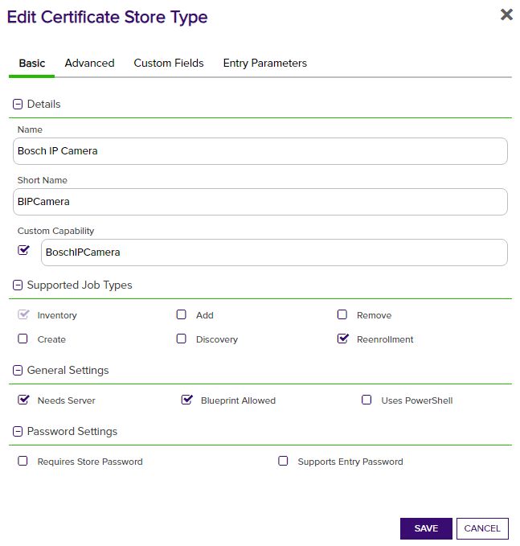
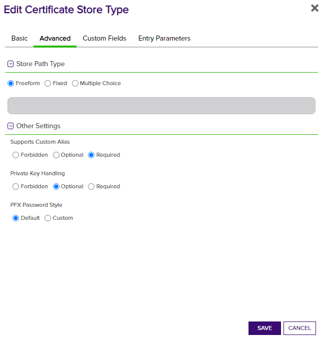
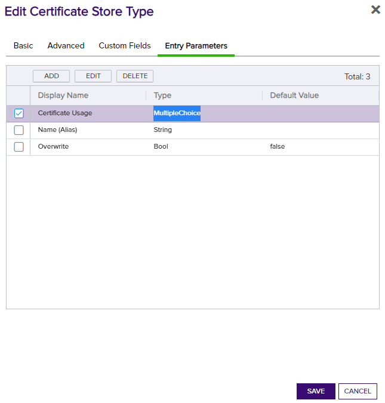
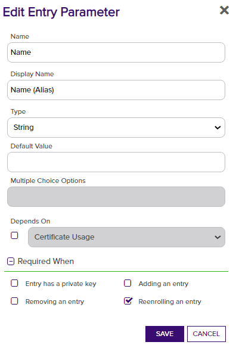
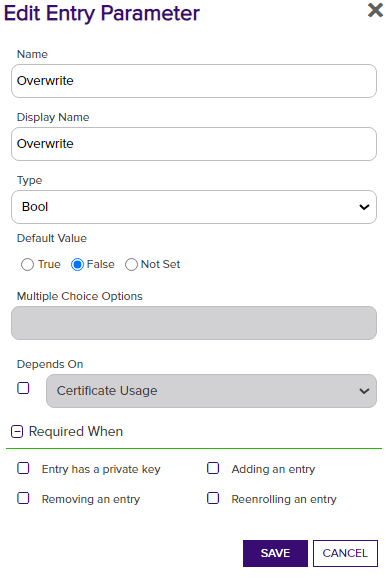
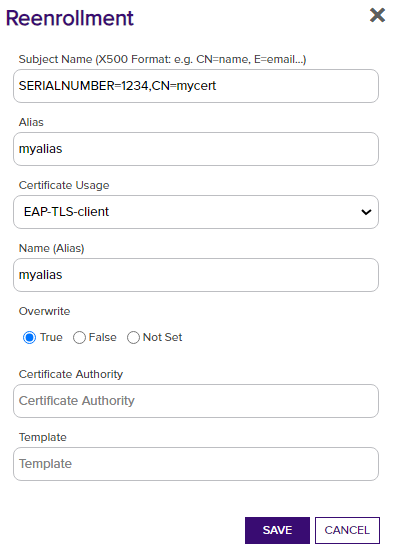

# Bosch IP Camera

Bosch IP Camera Orchestrator for Inventory and Reenrollment (on-device keygen) for existing and new certificates

#### Integration status: Production - Ready for use in production environments.

## About the Keyfactor Universal Orchestrator Extension

This repository contains a Universal Orchestrator Extension which is a plugin to the Keyfactor Universal Orchestrator. Within the Keyfactor Platform, Orchestrators are used to manage “certificate stores” &mdash; collections of certificates and roots of trust that are found within and used by various applications.

The Universal Orchestrator is part of the Keyfactor software distribution and is available via the Keyfactor customer portal. For general instructions on installing Extensions, see the “Keyfactor Command Orchestrator Installation and Configuration Guide” section of the Keyfactor documentation. For configuration details of this specific Extension see below in this readme.

The Universal Orchestrator is the successor to the Windows Orchestrator. This Orchestrator Extension plugin only works with the Universal Orchestrator and does not work with the Windows Orchestrator.

---

## Platform Specific Notes

The Keyfactor Universal Orchestrator may be installed on either Windows or Linux based platforms. The certificate operations supported by a capability may vary based what platform the capability is installed on. The table below indicates what capabilities are supported based on which platform the encompassing Universal Orchestrator is running.
| Operation | Win | Linux |
|-----|-----|------|
|Supports Management Add|  |  |
|Supports Management Remove|  |  |
|Supports Create Store|  |  |
|Supports Discovery|  |  |
|Supports Renrollment|&check; |  |
|Supports Inventory|&check; |  |

---

**Bosch Camera Configuration**

**Overview**

The Bosch IP Camera Orchestrator remotely manages certificates on the camera.

This agent implements two job types – Inventory and Reenrollment. Below are the steps necessary to configure Universal Orchestrator extension.

**Bosch IP Camera Configuration**

1. Out of the box, the camera comes with three accounts. You need an account created that has "service" level access:

2. Currently supports Bosch firmware version 7.10.0095 - 7.82. Has not been tested with any other firmeware version.

**1. Create the New Certificate Store Type for the Bosch IP Camera Universal Orchestrator**

In Keyfactor Command create a new Certificate Store Type similar to the one below:

#### STORE TYPE CONFIGURATION
| Setting Tab | Config Element | Value |
|-|-|-|
| Basic | Name | Bosch IP Camera |
| Basic | Short Name | BIPCamera |
| Basic | Custom Capability | &check; value: `BoschIpCamera` |
| Basic | Job Types	| Inventory, Reenrollment |
| Basic | Needs Server | &check; |
| Advanced | Store Path Type | Freeform |
| Advanced | Supports Custom Alias | Required |
| Advanced | Private Key Handling | Optional |
| Advanced | PFX Password Style | Default |
| Entry Parameters| See Below | See Below |

**Basic Settings:**

**Advanced Settings:**

**Entry Params:**

The entry parameters that need to be created are as follows:
| Name | Display Name | Type | Default Value | Multiple Choice Options | Required When |
|-|-|-|-|-|-|
| CertificateUsage | Certificate Usage | Multiple Choice | | `,HTTPS,EAP-TLS-client,TLS-DATE-client` | none selected |
| Name | Name (Alias) | String | | N/A | &check; Reenrolling an entry |
| Overwrite | Overwrite | Bool | False | N/A | none selected |

**2. Register the BoschIPCamera Universal Orchestrator with Keyfactor**
Within Windows File Explorer, navigate to the Keyfactor Orchestrator installation folder (usually C:\Program Files\Keyfactor\Keyfactor Orchestrator), find the "extensions" folder, and under that create a new folder named "BoschIPCamera". Under the BoschIPCamera folder copy all of the files from the downloaded release to this location.

**3. Create a Bosch IP Camera Store within Keyfactor Command**

In Keyfactor Command create a new Certificate Store setting the values based on the camera settings below:

#### STORE CONFIGURATION 
| Config Element | Description |
|-|-|
| Category |The type of certificate store to be configured. Select category based on the display name configured above "Bosch IP Camera". |
| Container | This is a logical grouping of like stores. This configuration is optional and does not impact the functionality of the store. |
| Client Machine | The IP address of the Camera.  Sample is "192.167.231.174:44444". Include the port if necessary. |
| Store Path | Enter the Serial Number of the camera e.g. `068745431065110085` |
| Orchestrator | This is the orchestrator server registered with the appropriate capabilities to manage this certificate store type. |
| Server Username | Enter the username of the configured "service" user on the camera |
| Server Password | Enter the password of the configured "service" user on the camera |
| Use SSL | Select True or False depending on if SSL (HTTPS) should be used to communicate with the camera. |
| Inventory Schedule | The interval that the system will use to report on what certificates are currently in the store. |

#### Usage

**Reenrollment**

**Important!** When using Reenrollment, the subject needs to include the Camera's serial number as an element. The Camera automatically adds this to the CSR it generates, and Keyfactor will not enroll the CSR unless it is included.
For example, with a serial number of '1234' and a desired subject of CN=mycert, the Subject entered for a reenrollment should read:
Subject:  `SERIALNUMBER=1234,CN=mycert`
The serial number is entered as the Store Path on the Certificate Store, and should be copied and entered as mentioned when running a reenrollment job.

| Reenrollment Field | Value | Description |
|-|-|-|
| Subject Name | `SERIALNUMBER=xxxx,CN=mycert,O=...` etc. | Comma-separated list of subject elements. Must include `SERIALNUMBER=` as described above. |
| Alias | Alias | The certificate Alias, and name to be assigned on the camera. Will allow for overwriting existing certs with the same name. |
| Certificate Usage | Select one, or blank | The Certificate Usage to assign to the cert after upload. Can be left blank to be assigned later. |
| Name (Alias) | Alias | The certificate Alias, entered again. |
| Overwrite | True, or False | Select `True` if using an existing Alias name to remove and replace an existing certificate. |

Running a Reenrollment job to issue a new certificate on the camera can happen in two ways. 
1. Right click on the cert store and chooose Reenrollment. In the dialog box, type "CN=Test" and click Done. A job will be created in the job queue that will perform on camera CSR that will be signed by a CA integrated with Keyfactor and then uploaded to the camera. Once complete, the camera will be rebooted. 
2. For auto renewals with Expiration Workflow
    a. Install ExperationAlertHandler.ps1 on Command server in C:\Program Files\Keyfactor\ExtensionLibrary
    b. Create a collection for each certificate type (or one for all cert types) used on cameras. Create an exiration alert and configure the Event Handler similar to the one below.
  
  #### Event Handler Configuration 
Parameter Name	|Type           |Value
----------------|---------------|------------
DN	    |Token  |dn
Host    |Value  |FDDN of keyfactor server. Example: https://customer.keyfactor.com
Locations   |Token |locations:certstore
ScriptName  |Script |ExpirationAlertHandler.ps1

