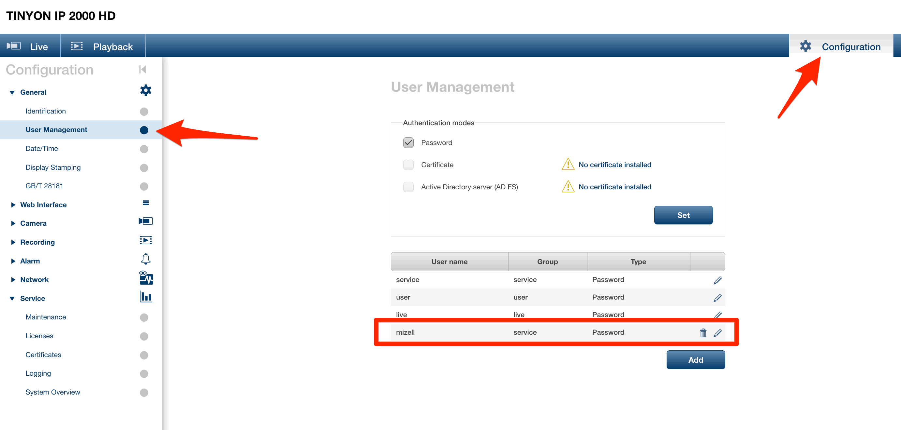
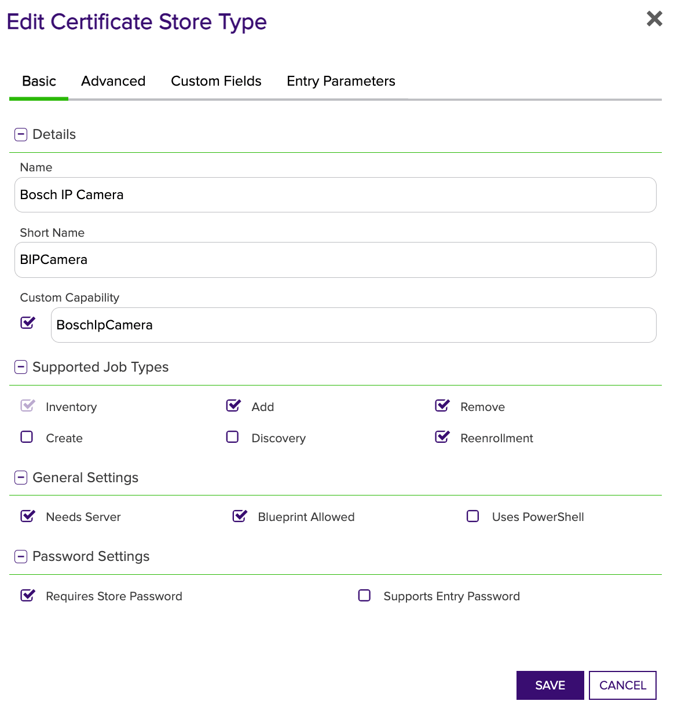
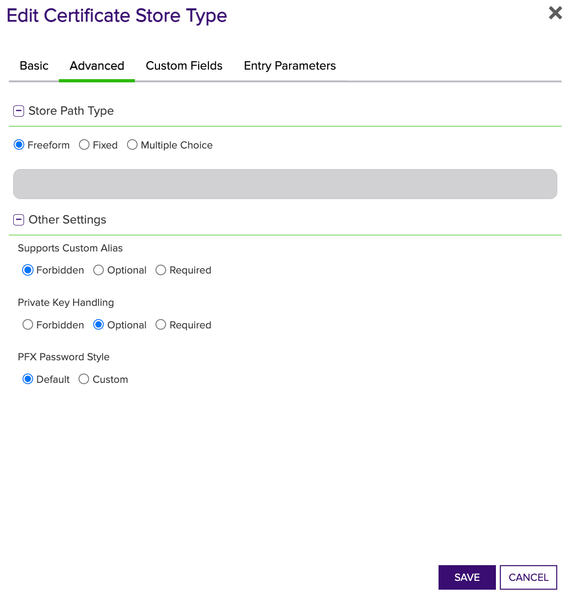
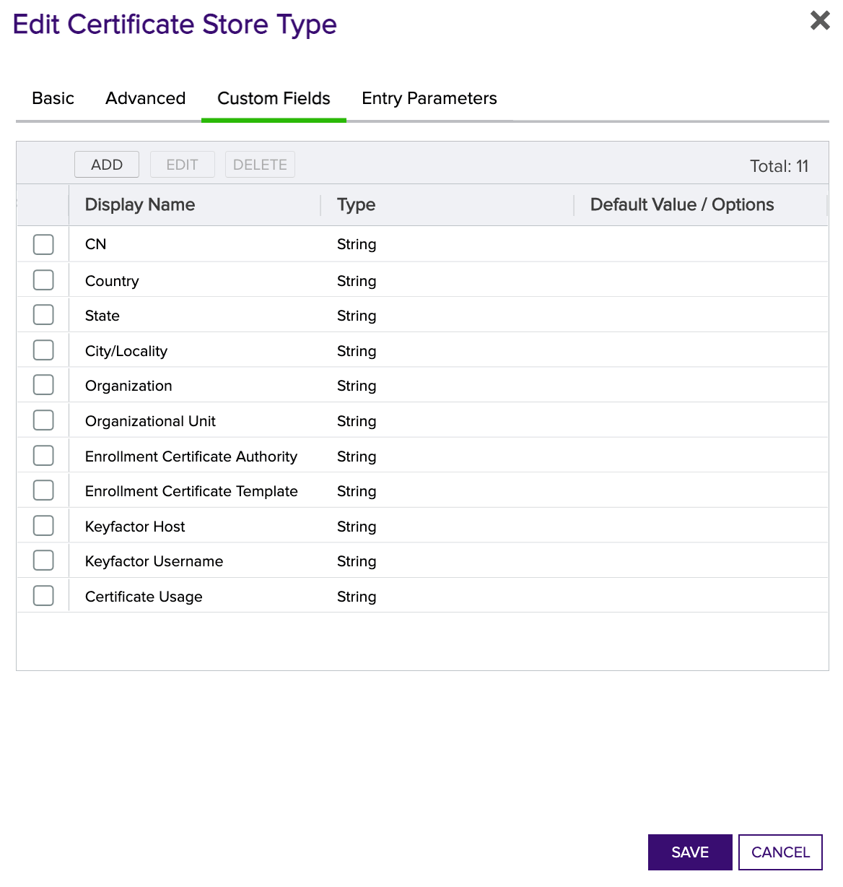
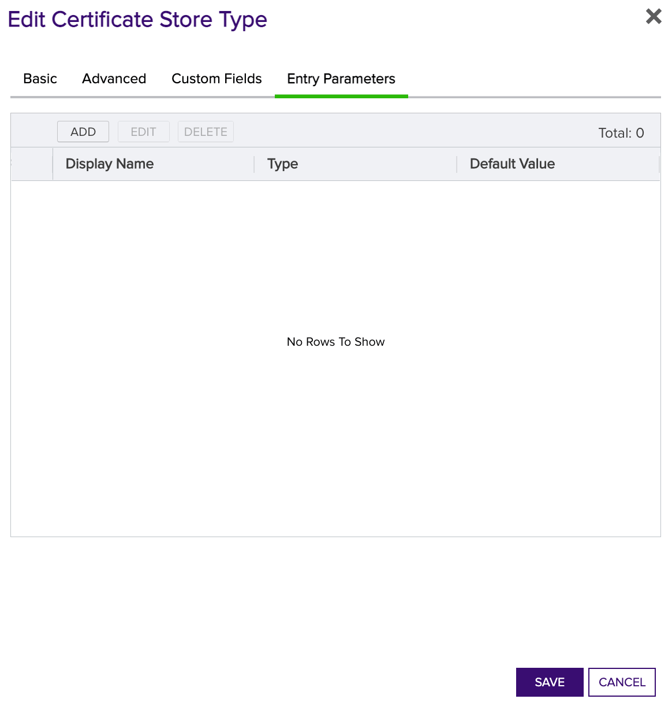
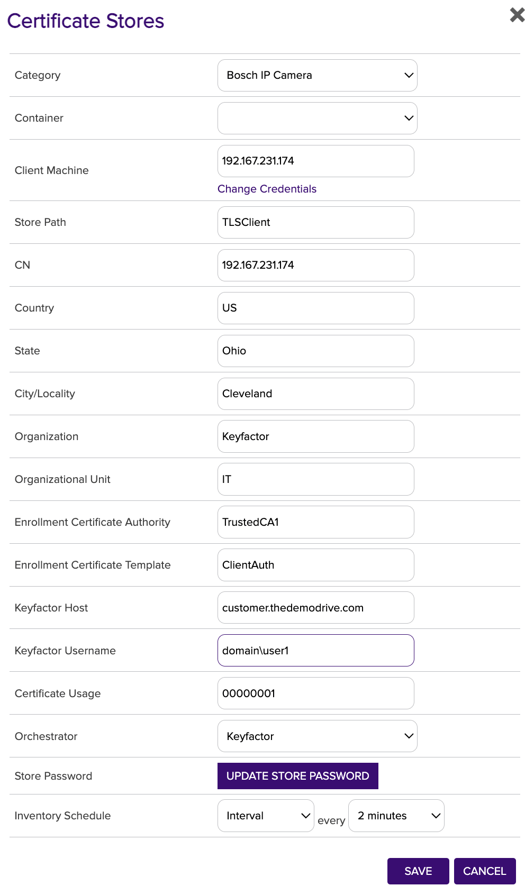
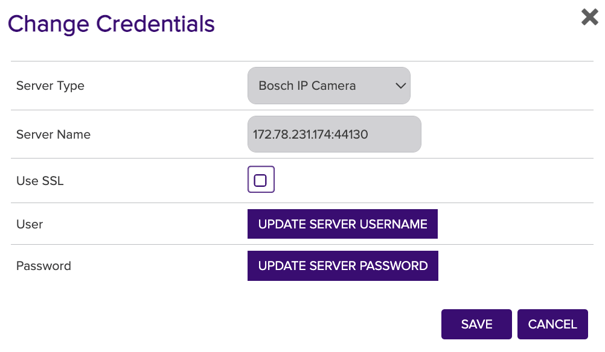
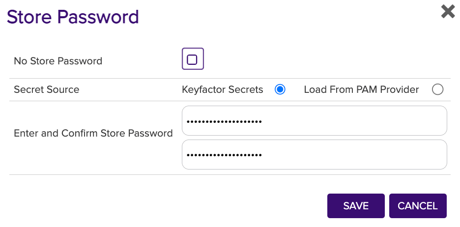
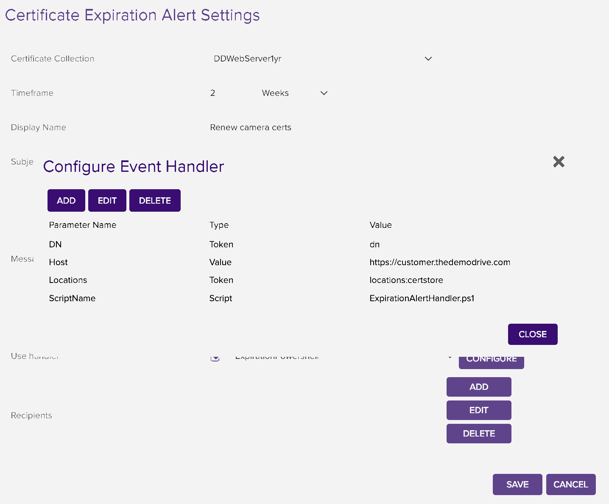

# Bosch IP Camera

Bosch IP Camera Orchestrator for Add, Remove and Inventory

#### Integration status: Prototype - Demonstration quality. Not for use in customer environments.

## About the Keyfactor Universal Orchestrator Capability

This repository contains a Universal Orchestrator Capability which is a plugin to the Keyfactor Universal Orchestrator. Within the Keyfactor Platform, Orchestrators are used to manage “certificate stores” &mdash; collections of certificates and roots of trust that are found within and used by various applications.

The Universal Orchestrator is part of the Keyfactor software distribution and is available via the Keyfactor customer portal. For general instructions on installing Capabilities, see the “Keyfactor Command Orchestrator Installation and Configuration Guide” section of the Keyfactor documentation. For configuration details of this specific Capability, see below in this readme.

The Universal Orchestrator is the successor to the Windows Orchestrator. This Capability plugin only works with the Universal Orchestrator and does not work with the Windows Orchestrator.

---

## Platform Specific Notes

The Keyfactor Universal Orchestrator may be installed on either Windows or Linux based platforms. The certificate operations supported by a capability may vary based what platform the capability is installed on. The table below indicates what capabilities are supported based on which platform the encompassing Universal Orchestrator is running.
| Operation | Win | Linux |
|-----|-----|------|
|Supports Management Add|&check; |  |
|Supports Management Remove|&check; |  |
|Supports Create Store|  |  |
|Supports Discovery|  |  |
|Supports Renrollment|  |  |
|Supports Inventory|&check; |  |

---

**Bosch Camera Configuration**

**Overview**

The Bosch IP Camera Orchestrator remotely manages certificates on the camera.

This agent implements three job types – Inventory, Reenrollment and Remove. Below are the steps necessary to configure this AnyAgent..

**Bosch IP Camera Configuration**

1. Out of the box, the camera comes with three accounts. You need an account created that has "service" level access:

2. Initial design is using HTTP because we don't have a trusted cert on the camera to use HTTPS. Further invenstigaion with prospects/customers will help us identify if we need to switch to HTTPS after the initial certificate is installed.
3. Currently supports Bosch firmware version 7.10.0095 - 7.82. Has not been tested with any other firmeware version.
4. The Camereas only support SHA256.

**1. Create the New Certificate Store Type for the Bosch IP Camera Universal Orchestrator**

In Keyfactor Command create a new Certificate Store Type similar to the one below:

#### STORE TYPE CONFIGURATION
SETTING TAB  |  CONFIG ELEMENT	| DESCRIPTION
------|-----------|------------------
Basic |Name	|Descriptive name for the Store Type.  Bosch IP Camera.
Basic |Short Name	|The short name that identifies the registered functionality of the orchestrator. Must be BIPCamera
Basic |Custom Capability|Checked, with value "BoschIpCamera".
Basic |Job Types	|Inventory, Remove and Reenrollment are the supported job types. 
Basic |Needs Server	|Must be checked
Basic |Blueprint Allowed	|Optional
Basic |Requires Store Password	|Determines if a store password is required when configuring an individual store.  This must be checked.
Basic |Supports Entry Password	|Determined if an individual entry within a store can have a password.  This must be unchecked.
Advanced |Store Path Type| Determines how the user will enter the store path when setting up the cert store. This will represent the file name on the camera. Select "Freeform"
Advanced |Supports Custom Alias	|Determines if an individual entry within a store can have a custom Alias.  Forbidden
Advanced |Private Key Handling |Determines how the orchestrator deals with private keys.  Optional
Advanced |PFX Password Style |Determines password style for the PFX Password. Default
Custom Fields|On camera CSR - CN|The name must be CN, the display name can be CN and check required
Custom Fields|On camera CSR - Country|The name must be country, the display name can be Country and check required, this can be defaulted based on customer need
Custom Fields|On camera CSR - State|The name must be state, the display name can be State and check required, this can be defaulted based on customer need
Custom Fields|On camera CSR - City/Locality|The name must be city, the display name can be City/Locality and check required, this can be defaulted based on customer need
Custom Fields|On camera CSR - Organization|The name must be org, the display name can be Organization and check required, this can be defaulted based on customer need
Custom Fields|On camera CSR - Organizational Unit|The name must be OU, the display name can be Organizational Unit and check required, this can be defaulted based on customer need
Custom Fields|Certificate Authority in Keyfactor|The name must be CA, the display name can be Enrollment Certificate Authority and check required, this can be defaulted based on customer need
Custom Fields|Certificate Template in Keyfactor|The name must be template, the display name can be Entrollment Certificate Template and check required, this can be defaulted based on customer need
Custom Fields|FQDN of Keyfactor Command for API calls|The name must be keyfactorHost, the display name can be Keyfactor Host and check required, this can be defaulted based on customer need
Custom Fields|Keyfactor user name for API calls|The name must be keyfactorUser, the display name can be Keyfactor Username and check required, this can be defaulted based on customer need
Custom Fields|Certificate Usage on Camera (80000000 - TLS_trust, 00000001 - TLS_client, 00000000 - HTTPS)|The name must be certUsage, the display name can be Certificate Usage and check required, this can be defaulted based on customer need
Entry Parameters|None required| N/A

**Basic Settings:**

**Advanced Settings:**

**Custom Fields:**

**Entry Params:**

**2. Register the BoschIPCamera Universal Orchestrator with Keyfactor**
Within Windows File Explorer, navigate to the Keyfactor Orchestrator installation folder (usually C:\Program Files\Keyfactor\Keyfactor Orchestrator), find the "extensions" folder, and under that create a new folder named "BoschIPCamera". Under the BoschIPCamera folder copy all of the files from the downloaded release to this location.

**3. Create a Bosch IP Camera Store within Keyfactor Command**

In Keyfactor Command create a new Certificate Store similar to the one below

#### STORE CONFIGURATION 
CONFIG ELEMENT	|DESCRIPTION
----------------|---------------
Category	|The type of certificate store to be configured. Select category based on the display name configured above "Bosch IP Camera".
Container	|This is a logical grouping of like stores. This configuration is optional and does not impact the functionality of the store.
Client Machine	|The IP address of the Camera.  Sample is "192.167.231.174". May or may not require the port.
Server credentials	|Enter the username and password to remotely access the camera via basic authentication, or configure retrieval of these values from an external system.
Store Path	|Naming conventions used in the camera for the type of cert (customer to define). Example "TLSClient" for client certs and "HTTPSCert" for server certs.
CN	|For on device CSR
Country	|For on device CSR
State	|For on device CSR
City/Locality	|For on device CSR
Organization	|For on device CSR
Organizational Unit	|For on device CSR
Enrollment Certificate Authority	|CA to sign the CSR with. Example:"Customer Main CA"
Enrollment Certificate Template	|Template shortname used for CSR signing. Example:"ClientAuthCert"
Keyfactor Host	|FQDN of Keyfactor Command for API calls. Example:customer.keyfactor.com
Keyfactor Username	|Username for API calls in Keyfactor Command.
Certificate Usage	|Bosch Camera usage code. See options above.
Orchestrator	|This is the orchestrator server registered with the appropriate capabilities to manage this certificate store type. 
Store Password	|Password for Keyfactor Username used for Keyfactor API call during certificate reenrollment jobs.
Inventory Schedule	|The interval that the system will use to report on what certificates are currently in the store. 
Use SSL	|This should NOT be checked.

#### Usage

**Reenrollment**

This can happen in two ways. 
1. Right click on the cert store and chooose Reenrollment. In the dialog box, type "CN=Test" and click Done. A job will be created in the job queue that will perform on camera CSR that will be signed by a CA integrated with Keyfactor and then uploaded to the camera. Once complete, the camera will be rebooted. 
2. For auto renewals with Expiration Workflow
    a. Install ExperationAlertHandler.ps1 on Command server in C:\Program Files\Keyfactor\ExtensionLibrary
    b. Create a collection for each certificate type (or one for all cert types) used on cameras. Create an exiration alert and configure the Event Handler similar to the one below.
  
  #### Event Handler Configuration 
Parameter Name	|Type           |Value
----------------|---------------|------------
DN	    |Token  |dn
Host    |Value  |FDDN of keyfactor server. Example: https://customer.keyfactor.com
Locations   |Token |locations:certstore
ScriptName  |Script |ExpirationAlertHandler.ps1

