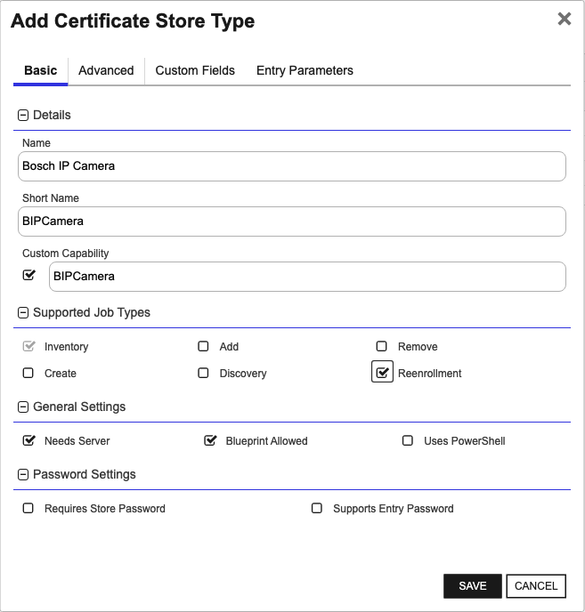
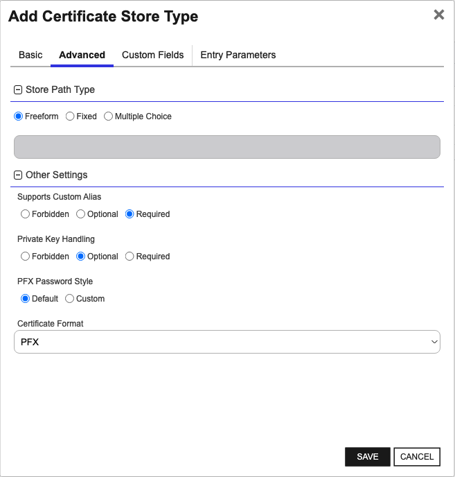

## Bosch IP Camera

The Bosch IP Camera Certificate Store Type within the Keyfactor Command environment is designed to facilitate the management and lifecycle of cryptographic certificates on Bosch IP Cameras. This store type represents a collection of certificates that are managed on a particular Bosch IP Camera. By using this store type, administrators can perform critical operations such as inventory, certificate reenrollment, addition, and removal, ensuring that the security measures of the camera are up-to-date and compliant with organizational policies.

### Functionality

The primary functionality of the Bosch IP Camera Certificate Store Type revolves around the automated handling of certificates. This includes fetching an inventory of existing certificates, adding new certificates, removing outdated or compromised certificates, and reenrolling certificates when required. The Certificate Store Type eliminates the need for manual certificate management on individual cameras, thereby streamlining administrative tasks and reducing the likelihood of human error.

### Representation

A defined Certificate Store of the Bosch IP Camera Store Type represents a logical grouping of certificates managed on a specific Bosch IP Camera. It includes essential configurations such as the camera's IP address, serial number, and authentication credentials. This configuration ensures secure and efficient communication between Keyfactor Command and the camera.

### Caveats and Limitations

One notable caveat is the requirement that the subject used in reenrollment jobs must include the camera's serial number. This is a specific requirement because the camera automatically adds this information to the Certificate Signing Request (CSR) it generates, and Keyfactor Command will not enroll the CSR unless it includes the serial number. Additionally, administrators must ensure that accurate and complete information is provided in the Store Path configuration to avoid any mismanagement or erroneous certificate operations.

### SDK and Tools

The Bosch IP Camera Certificate Store Type may require integrating with specific SDKs or tools provided by Bosch to facilitate communication and operations on the camera. While the readme_source.md does not detail any specific SDKs, it is essential for administrators to be aware of any such requirements based on their specific camera models and firmware versions.

### Areas for Confusion

Administrators should be mindful of the different fields and configurations needed for setting up the Certificate Store, such as IP addresses, serial numbers, and user credentials. Misconfigurations can lead to failed operations or prolonged administrative overhead. Moreover, distinct fields like 'Certificate Usage,' 'Name (Alias),' and 'Overwrite' configuration must be correctly understood and applied to avoid unintended certificate handling behavior.


### Supported Job Types

| Job Name | Supported |
| -------- | --------- |
| Inventory | ✅ |
| Management Add | ✅ |
| Management Remove | ✅ |
| Discovery |  |
| Create |  |
| Reenrollment |  |

## Requirements

No requirements found


## Certificate Store Type Configuration

The recommended method for creating the `BIPCamera` Certificate Store Type is to use [kfutil](https://github.com/Keyfactor/kfutil). After installing, use the following command to create the `` Certificate Store Type:

```shell
kfutil store-types create BIPCamera
```

<details><summary>BIPCamera</summary>

Create a store type called `BIPCamera` with the attributes in the tables below:

### Basic Tab
| Attribute | Value | Description |
| --------- | ----- | ----- |
| Name | Bosch IP Camera | Display name for the store type (may be customized) |
| Short Name | BIPCamera | Short display name for the store type |
| Capability | BIPCamera | Store type name orchestrator will register with. Check the box to allow entry of value |
| Supported Job Types (check the box for each) | Add, Discovery, Remove | Job types the extension supports |
| Supports Add | ✅ | Check the box. Indicates that the Store Type supports Management Add |
| Supports Remove | ✅ | Check the box. Indicates that the Store Type supports Management Remove |
| Supports Discovery |  |  Indicates that the Store Type supports Discovery |
| Supports Reenrollment |  |  Indicates that the Store Type supports Reenrollment |
| Supports Create |  |  Indicates that the Store Type supports store creation |
| Needs Server | ✅ | Determines if a target server name is required when creating store |
| Blueprint Allowed | ✅ | Determines if store type may be included in an Orchestrator blueprint |
| Uses PowerShell |  | Determines if underlying implementation is PowerShell |
| Requires Store Password |  | Determines if a store password is required when configuring an individual store. |
| Supports Entry Password |  | Determines if an individual entry within a store can have a password. |

The Basic tab should look like this:



### Advanced Tab
| Attribute | Value | Description |
| --------- | ----- | ----- |
| Supports Custom Alias | Required | Determines if an individual entry within a store can have a custom Alias. |
| Private Key Handling | Optional | This determines if Keyfactor can send the private key associated with a certificate to the store. Required because IIS certificates without private keys would be invalid. |
| PFX Password Style | Default | 'Default' - PFX password is randomly generated, 'Custom' - PFX password may be specified when the enrollment job is created (Requires the Allow Custom Password application setting to be enabled.) |

The Advanced tab should look like this:



### Custom Fields Tab
Custom fields operate at the certificate store level and are used to control how the orchestrator connects to the remote target server containing the certificate store to be managed. The following custom fields should be added to the store type:

| Name | Display Name | Type | Default Value/Options | Required | Description |
| ---- | ------------ | ---- | --------------------- | -------- | ----------- |


The Custom Fields tab should look like this:


</details>

## Certificate Store Configuration

After creating the `BIPCamera` Certificate Store Type and installing the Bosch IP Camera Universal Orchestrator extension, you can create new [Certificate Stores](https://software.keyfactor.com/Core-OnPrem/Current/Content/ReferenceGuide/Certificate%20Stores.htm?Highlight=certificate%20store) to manage certificates in the remote platform.

The following table describes the required and optional fields for the `BIPCamera` certificate store type.

| Attribute | Description | Attribute is PAM Eligible |
| --------- | ----------- | ------------------------- |
| Category | Select "Bosch IP Camera" or the customized certificate store name from the previous step. | |
| Container | Optional container to associate certificate store with. | |
| Client Machine | The IP address of the Bosch IP Camera, optionally including the port number if necessary. Example: '192.167.231.174:44444'. | |
| Store Path | The serial number of the Bosch IP Camera. Example: '068745431065110085'. | |
| Orchestrator | Select an approved orchestrator capable of managing `BIPCamera` certificates. Specifically, one with the `BIPCamera` capability. | |

* **Using kfutil**

    ```shell
    # Generate a CSV template for the AzureApp certificate store
    kfutil stores import generate-template --store-type-name BIPCamera --outpath BIPCamera.csv

    # Open the CSV file and fill in the required fields for each certificate store.

    # Import the CSV file to create the certificate stores
    kfutil stores import csv --store-type-name BIPCamera --file BIPCamera.csv
    ```

* **Manually with the Command UI**: In Keyfactor Command, navigate to Certificate Stores from the Locations Menu. Click the Add button to create a new Certificate Store using the attributes in the table above.